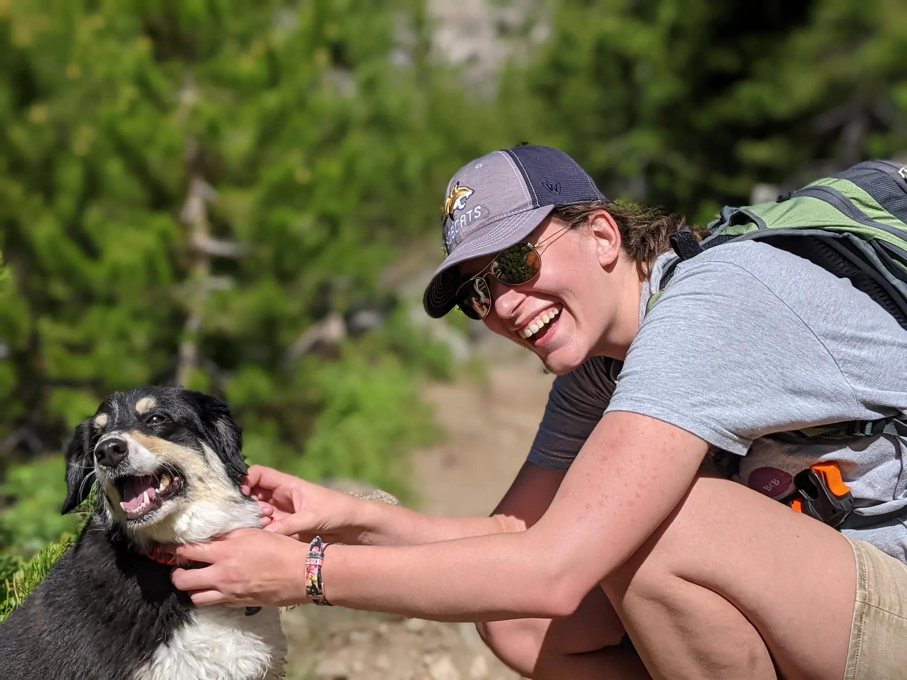

---
menu:
    main:
        name: Home
        weight: -100
        params:
            icon: home
title: "Welcome to my blog!"
description: ""
draft: false
# image: "cover.webp"
---

I'm a software engineer who loves finding vulnerabilities in software and maintaining security compliance. I just finished a Masters of Science in computer science. 

**Here's my [Thesis](assets/ThesisOnBugBountyPlatforms.pdf) and my [Resume](assets/SusanMcCartneyResume.pdf).**

In my free time, I like to read mystery novels, solve puzzles, bake/cook new recipes, and learn different hobbies with the supervision of my favorite dog, Lucy.

I'm starting this blog to document my learning in Computer Science, and to share the things I already know.

    

